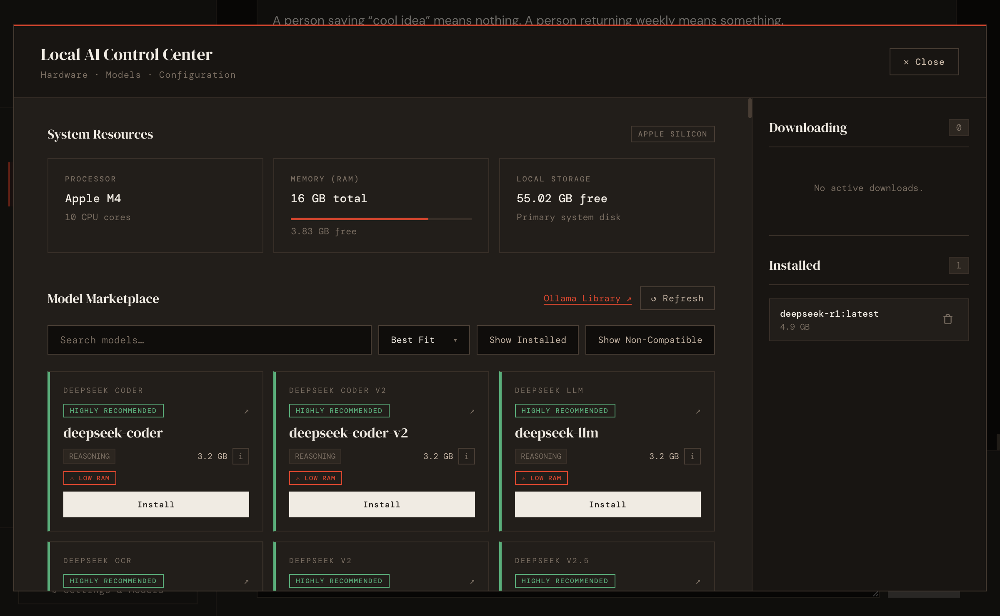

# LLM Council


Local multi-model chat that lets a council of LLMs answer the same prompt, critique each other, and synthesize a final response.

> Forked from [karpathy/llm-council](https://github.com/karpathy/llm-council) and improved with local-first, cost-effective workflows. No API keys, no per-token billing — runs entirely on your machine.

`llm-council` runs local models via [Ollama](https://ollama.com/). Manage models from the app, get hardware-aware recommendations, and designate a chairman model to produce the final synthesis.

## Screenshots

### Settings — discover and manage models



## Project Status

This project is open source and usable today. Forks are encouraged. Pull requests are welcome, but review and support are best-effort.

## How It Works

Single-model chats hide disagreement. LLM Council makes it visible through a 3-stage deliberation:

1. **Stage 1: First opinions**
   Each council model answers the same prompt independently. Side-by-side comparison reveals style differences, blind spots, and tradeoffs.
2. **Stage 2: Cross-review**
   Models review **anonymized** peer responses and rank them for quality and insight. Anonymization prevents favoritism — models don't know whose response they're evaluating.
3. **Stage 3: Synthesis**
   A chairman model produces the final answer using all stage outputs and ranking signals.

### Modes

**Auto Mode** — Full 3-stage flow. Select council members, chairman, and a synthesis profile. Stages run automatically in sequence. Supports **Hybrid Model** configurations where you can mix local Ollama models with API-based cloud models (OpenAI, Anthropic, Gemini, DeepSeek, OpenRouter) in the same council.

**Manual Mode** — Paste responses from external models (ChatGPT, Claude, Gemini, etc.) directly into the app, or **upload research text files** (PDF, TXT, MD, CSV, JSON) to analyze and synthesize findings across different sources or models. Manual mode skips Stage 2 (peer ranking) and sends your curated or uploaded responses straight to the chairman for synthesis. Add or remove model slots with the **+ Add Another Model** button. At least 2 responses required.

## Features

- Multi-model prompt execution with side-by-side outputs
- Anonymized cross-model review and ranking
- Final synthesis by a designated chairman model
- Auto mode supporting **Hybrid Councils** (mix local Ollama and cloud API models)
- Manual mode supporting **pasted responses** and **uploaded text files** (PDF, TXT, MD, CSV, JSON) to analyze and synthesize research across different models
- Local Ollama model discovery, pull, and deletion (with progress bar)
- Cloud model discovery and API key configuration via Settings panel (OpenAI, Anthropic, Gemini, DeepSeek, OpenRouter)
- Hardware-aware local model recommendations
- Dark and light themes

## Requirements

- **Python 3.10+** — [python.org](https://www.python.org/downloads/)
- **uv** — Python package manager
  ```bash
  curl -LsSf https://astral.sh/uv/install.sh | sh
  ```
- **Node.js + npm** — [nodejs.org](https://nodejs.org/)
- **Ollama** — local model serving
  ```bash
  curl -fsSL https://ollama.com/install.sh | sh
  ```
- **Git** — [git-scm.com](https://git-scm.com/)

## Setup

### 1. Clone the repository

```bash
git clone https://github.com/kumarsagarmaiti/llm-council.git
cd llm-council
```

### 2. Run the app

**Linux / macOS / Windows (WSL2):**

```bash
./start.sh
```

This handles everything — installs Python dependencies, installs npm packages, starts backend and frontend.

**Windows (native):**

Open two terminals.

Terminal 1 — backend:
```bash
uv sync
uv run python -m backend.main
```

Terminal 2 — frontend:
```bash
cd frontend
npm install
npm run dev
```

### 3. Open the app

Navigate to **http://localhost:5173**.

### 4. Pull models

Open **Settings & Models** (gear icon in sidebar) to discover and pull local models. The app recommends models based on your RAM and disk space. Make sure Ollama is running before pulling.

## Configuration

### Local & Cloud Models
Council members and the chairman are selected dynamically.
- **Local Models**: Manage and pull local models using the in-app **Settings & Models** panel (gear icon in sidebar). Recommendations are made automatically based on your system RAM and disk space. Make sure Ollama is running.
- **Cloud Models**: Configure API keys for direct providers (OpenAI, Anthropic, Gemini, DeepSeek, OpenRouter) in the settings panel. Once a valid key is provided, the application will automatically discover, list, and enable those frontier models in your council selection dropdowns, enabling **Hybrid Council** setups.

Conversation storage path defaults to `data/conversations/`. Override with the `LLM_COUNCIL_DATA_DIR` environment variable.

## Troubleshooting

### "Connection refused" or models won't load

Ollama is not running. Start it:

```bash
ollama serve
```

### Port 8001 already in use

```bash
lsof -ti:8001 | xargs kill
```

### Port 5173 already in use

```bash
lsof -ti:5173 | xargs kill
```

### No models appear in the app

You haven't pulled any models yet. Open **Settings & Models** and pull at least one model. For low-RAM machines (8GB), start with `llama3.2` or `phi3`.

### "uv: command not found"

Install uv:
```bash
curl -LsSf https://astral.sh/uv/install.sh | sh
```
Then restart your terminal, or add `~/.cargo/bin` to your `PATH`.

### Frontend can't reach backend

Backend runs on port 8001. Check it started:
```bash
cat backend.log
```
Make sure nothing else is using port 8001.

## Development

Useful files while working on the project:

- `backend/main.py` — API routes
- `backend/council.py` — council orchestration
- `backend/models_manager.py` — local Ollama operations
- `frontend/src/App.jsx` and `frontend/src/components/` — UI

## Testing

Backend tests:

```bash
uv run python -m unittest discover tests
```

Frontend validation build:

```bash
cd frontend
npm run build
```

## Open Source Notes

This repository is intentionally lightweight:

- Fork it freely if you want to adapt it for your own model workflows.
- Small, scoped pull requests are easier to review than large rewrites.
- Issues and PRs may be reviewed when possible, but there is no guaranteed response timeline.

## Contributing

See [CONTRIBUTING.md](CONTRIBUTING.md) for contribution guidelines and development expectations.

## Security

See [SECURITY.md](SECURITY.md) for vulnerability reporting guidance.

## License

MIT. See [LICENSE](LICENSE).
